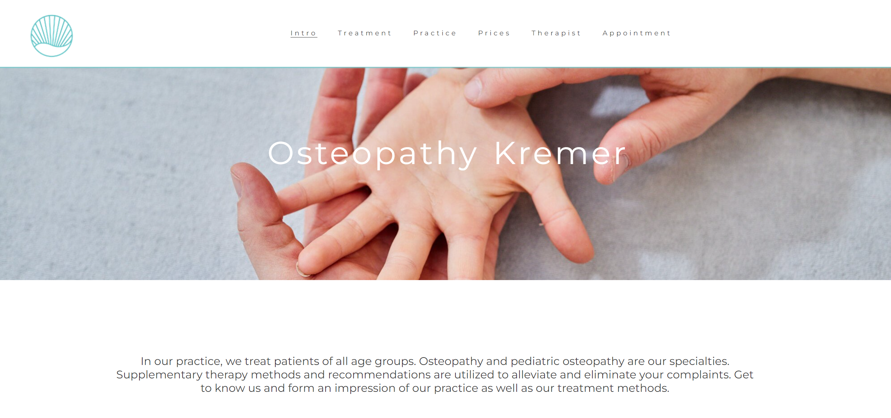

# Osteopathy Kremer 

This site is the public web presence of an Osteopathy praxis in Jena Germany. It offers osteopathic and manual therapeutic healthcare services for their interested visitors. The visitor gets relevant information about the treatment, conditions and the therapeut. 
Furthermore the visitor has the possibility to request an appointment via contact form.  

## User Stories
- As a user I want to get informed about offerings and services of Osteopathy Kremer 
- As a user I want to get informed about effect of Osteopathy and about the process of the treatment in the practice 
- As a user I want to get informed about the prices and the location 
- As a user I want to get an impression of the ambience of Oseopathy practice
- As a user I want to get an impressiom of the therapeut and his skills
- As a user I want to know how to get in contact and book an appointment 

## Design

###Imagery
The imagery should give the user an impression of a warm and caring contact by hands. He should get the feeling that he would the get treated by this therapist.

###Colours
The colours should have a clear canon. A colour should not be used only once, it should appear repeatedly. For example the blue form the logo appears again in the menu icon and in the border lines of the website; the grey from the hands background appears again in the footer. The colours were chosen to give the user a clear an straight impression. 

## Wireframe

Wireframes were created with Balsamiq.

Desktop Wireframe

Mobile Wireframe

## Features

__Navigation Bar__

- The navigation bar includes links to the sections of the homepage (Intro, Treatment, Practice and Prices) and links to other pages of the website: therapist and appointment form 
- The navigation is responsive and changes in layout and functionality according to the screen size. Large screens are shown in a horizontel navigation bar. Mobile phone and tablets have toggle icon to expand the vertical menu. 
- For large and vertical mobile screens the navigation bar has a fixed position so it stays visible for the user when he navigates through the website. For mobile screens in landscape view it is not fixed, because to focus here is more on the readability of the content.

__Landing Page__
  - This page gives the visitor an overview about relevant aspects of the osteothic practice, such as:
    - What they can expect from an Osteopathic treamtent?
    - What will happen in the practice?
    - Prices and healtcare insurance information
  - The images should give the visitor a feeling that he will get a warm and careful treatment from this Osteopathy Practice

__Therapist__

  - This page gives information about the methods and skills of the therpist 
  - It should give a first impression to the visitor what kind of person and treatments they can expect

 

__Request appointment form__
  - Interested visitor can book an appointment or ask any question to the therapist

__Footer with social media links__
 
 - On each page we provide links to social media where more information can be found
 
 

## Testing

### Validator Testing

- HTML
    - WC3 validator results
     ![image]
    - The check showed no errors or warnings

- CSS
    - Jigsaw validator results
!    - The check showed no errors or warnings
    
 - Acessibility score through the lighthouse

The page was tested after deployment on mobile phone, laptop, desktop and tablet pad for responsiveness and functionality and on different browsers

## Bugs encountered

## Deployment

This section describes how the code was deployed

-The site was deployed on GitHub pages by executing the following steps
  - In GitHub repository clicking on settings menu, then in side menu "pages"
  - In source dropdown select "deploy from branch"
  - In branch dropdown select "main" and "root"
  - After clicking on save the url for the website will be displayed as soon as the deployment is done a few minutes later and after refreshing the page

  The live link can be found [here](https://clekremer.github.io/portfolio1_osteopathyKremer/index.html)
  
## Technologies used
__Main Languages__

-  [HTML5](https://en.wikipedia.org/wiki/HTML5)
-  [CSS](https://en.wikipedia.org/wiki/CSS)

__Frameworks, Libraries & Programs Used__
- [Gitpod](https://www.gitpod.io/) was used for developing the code as IDE, commiting and pusing code to repository
- [Github](https://github.com/) was using for storing repositories, and deployment via github pages
- [Am I responsive](http://ami.responsivedesign.is/) was used to check the responsiveness of the site, and create a mock-up images to be used for this page
- [Jigsaw](https://jigsaw.w3.org/css-validator/) validator was used to check the CSS code for errors and warnings
- [W3C](https://validator.w3.org/) validator was used to check the HTML5 code for errors and warnings
- Google Chrome's lighthouse was used to check performance, accesibility and tips on how to improve the user experience and performance

## Credits 

I used sniplets of code from the [love running](https://code-institute-org.github.io/love-running-2.0/index.html) example: footer, header and navigation menu 

Content ideas were used from "Osteopathie Kremer Jena" my own Homepage: [Osteopathie Kremer](https://www.osteopathie-jena.net/)

Images were made in my own Osteopathy practice. The photograph was Nikolaus Brade: http://nikolausbrade.de/