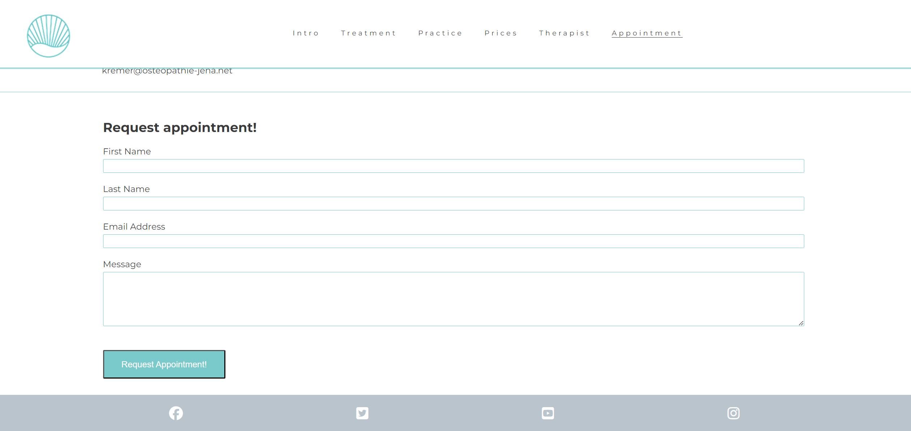

# Osteopathy Kremer 

This site is the public web presence of an Osteopathy praxis in Jena Germany. It offers osteopathic and manual therapeutic healthcare services for their interested visitors. The visitor gets relevant information about the treatment, conditions and the therapeut. 
Furthermore the visitor has the possibility to request an appointment via contact form.  

## User Stories

## Features

__Navigation Bar__

__Landing Page__
  - This page gives the visitor an overview about relevant aspects of the osteothic practice, such as:
    - What they can expect from an Osteopathic treamtent?
    - What will happen in the practice?
    - Prices and healtcare insurance information

__Therapist__

  - This page gives information about the methods and skills of the therpeut 
  - It should give a first impression to the visitor what kind of person and treatments they can expect

 

__Request appointment form__
  - Interested visitor can book an appointment

__Footer with social media links__
 
 - On each page we provide links to social media where more information can be found
 
 

## Testing

### Validator Testing

- HTML
    - WC3 validator results
     ![image]
    - The check showed no errors or warnings

- CSS
    - Jigsaw validator results
!    - The check showed no errors or warnings
    
 - Acessibility score through the lighthouse

The page was tested after deployment on my own phone, laptop, desktop and ipad for responsiveness and functionality and on different browsers

## Bugs encountered

## Deployment

This section describes how the code was deployed

- The site was deployed to GitHub pages using the following steps
  - In the github repository, navigate to the settings tab
  - From the source section drop-down menu, select the Master Branch
  - Once the master branch has been selected, the page will be automatically refreshed with a detailed ribbon display to indicate the successful deployment.

  The live link can be found [here](https://clekremer.github.io/portfolio1_osteopathyKremer/index.html)
  
## Technologies used
__Main Languages__

-  [HTML5](https://en.wikipedia.org/wiki/HTML5)
-  [CSS](https://en.wikipedia.org/wiki/CSS)

__Frameworks, Libraries & Programs Used__
- [Gitpod](https://www.gitpod.io/) was used for developing the code as IDE, commiting and pusing code to repository
- [Github](https://github.com/) was using for storing repositories, and deployment via github pages
- [Am I responsive](http://ami.responsivedesign.is/) was used to check the responsiveness of the site, and create a mock-up images to be used for this page
- [Jigsaw](https://jigsaw.w3.org/css-validator/) validator was used to check the CSS code for errors and warnings
- [W3C](https://validator.w3.org/) validator was used to check the HTML5 code for errors and warnings
- Google Chrome's lighthouse was used to check performance, accesibility and tips on how to improve the user experience and performance

## Credits 

I used sniplets of code from the [love running](https://code-institute-org.github.io/love-running-2.0/index.html) example

Content ideas from "Osteopathie Kremer Jena" my own Homepage: [Osteopathie Kremer](https://www.osteopathie-jena.net/)